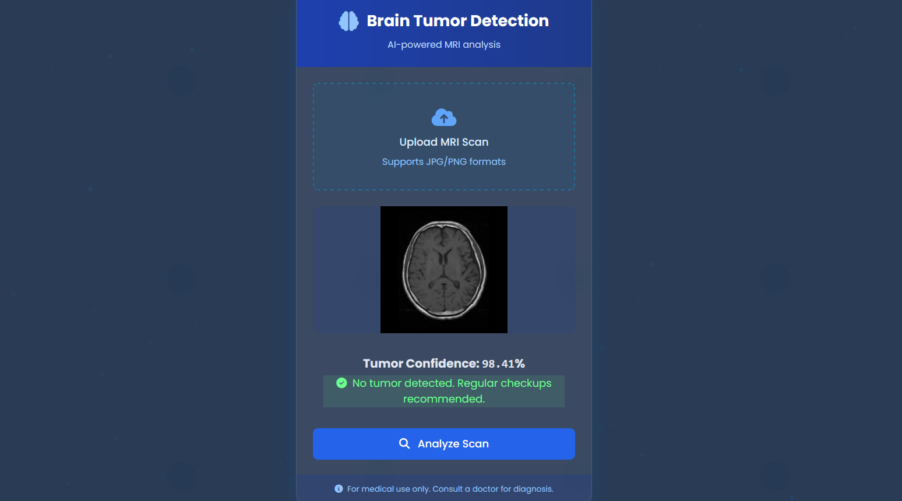
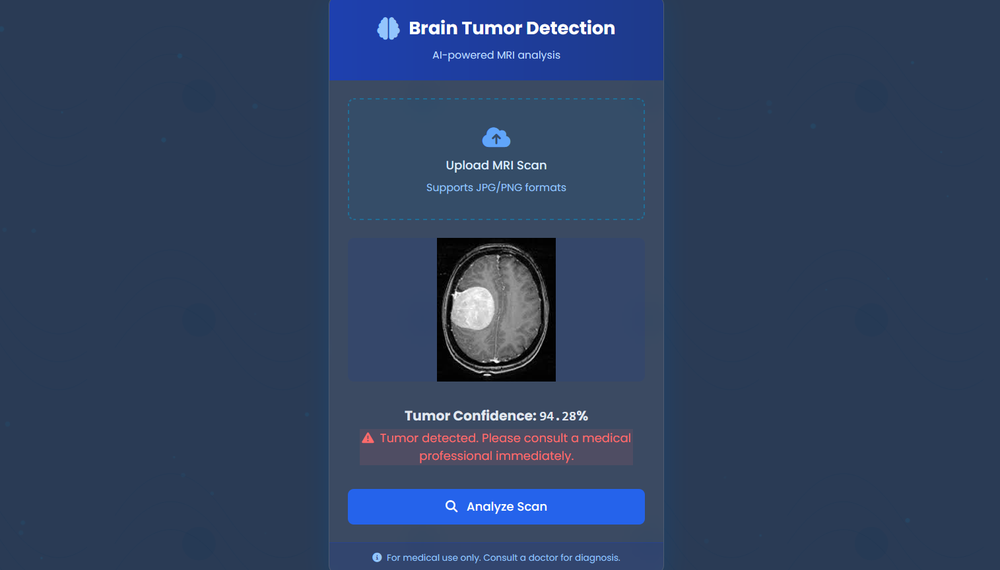

# Brain Tumor Detection System

An AI-powered system for detecting brain tumors in MRI scans using deep learning. Achieves **98.5% accuracy** on validation data.

## Features
- **AI-Powered Analysis**: Uses Swin Transformer model for high-accuracy detection
- **Medical-Grade UI**: Clean interface designed for clinical use
- **Instant Results**: Provides tumor confidence percentage in seconds
- **DICOM Support**: Compatible with standard medical imaging formats

## Screenshots

| No Tumor Detected | Tumor Detected |
|-------------------|----------------|
|  |  |

## Technical Stack
- **Model**: Swin Transformer (Swin-B)
- **Framework**: PyTorch
- **Inference API**: Flask/FastAPI
- **Frontend**: HTML5/CSS3 + JavaScript

## Installation

### Prerequisites
- Python 3.8+
- GPU with CUDA 11.7 (recommended)

### Setup
```bash
# Clone repository
git clone https://github.com/yourusername/brain-tumor-detection.git
cd brain-tumor-detection

# Install dependencies
pip install -r requirements.txt

# Download model weights (using gdown)
pip install gdown
gdown https://drive.google.com/uc?id=YOUR_MODEL_ID -O model.pth
